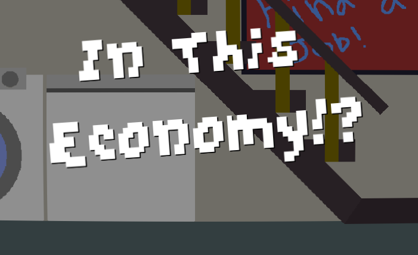
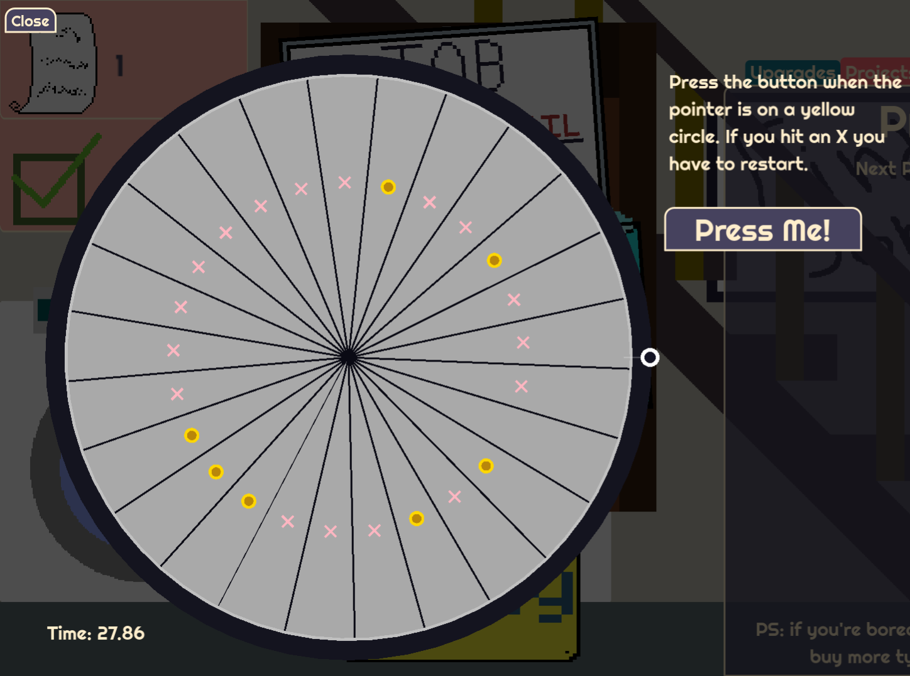
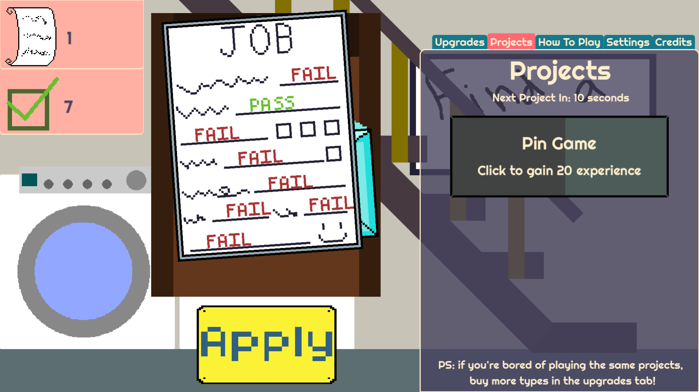

# In This Economy?!
**A game simulating the struggles of finding a job in the current climate.**
Playable in web [here](https://orangepainting.itch.io/in-this-economy)

**Description:**
- An Incremental Clicker Game
- Submit Applications and Improve your Chances of Landing a Job!
- Mobile Friendly
- Made in 7 days for [The Juniper Dev Very Serious Game Jam](https://itch.io/jam/theveryseriousjuniperdevgamejam) and Hack Club's [Stardance](https://stardance.hackclub.com/home)
- Have Fun!

 

**Software Used:**
- Project made entirely within the free and open-source [Godot Game Engine](https://godotengine.org/)
- Sprites made using **Aseprite**, a pixel art creator

**Credits**
- Main Menu Music: "Jazz Funk" by Joe Reynolds - Professorlamp is licensed under CC BY 3.0
- Soft Retro Godot Theme by intergenic - intergenic.itch.io/godot-theme-soft-retro
- Everything else made by me (OrangePainting) and Public Domain
- If you want to provide feedback, fill out this [form!](https://docs.google.com/forms/d/1ufzbGCAVbxwbOcDzYi_aPoPhfTXNUP0A59L4cux0gQc/edit) or comment on the game's itch page. Thanks!
